# 🤖 Карта сценария бота

**Сгенерировано:** 03.02.2026 13:37:33

| Метрика | Значение |
|---------|----------|
| Экранов | 64 |
| Кнопок | 170 |
| С обработчиками | 61 |
| Битых ссылок | 6 |

## ⚠️ Битые ссылки

- `account.config` → [📥 Скачать конфиг] → ❌ `account.download`
- `main.menu` → [Установить Easy Light] → ❌ `install.main`
- `main.menu` → [Документация] → ❌ `docs.main`
- `support.main` → [✍️ Написать в поддержку] → ❌ `support.write`
- `troubleshoot.main` → [🍎 macOS] → ❌ `troubleshoot.macos`
- `troubleshoot.main` → [📱 iOS/Android] → ❌ `troubleshoot.mobile`

## 📊 Диаграмма связей

```mermaid
flowchart TD

    subgraph Account
        account_config["Конфигурация VPN"]
        account_main["Личный кабинет"]
        account_status["Статус подписки"]
    end

    subgraph Faq
        faq_about["О сервисе"]
        faq_broken["Что-то сломалось"]
        faq_broken_android["Android"]
        faq_broken_android_p1["Проблема 1"]
        faq_broken_android_p2["Проблема 2"]
        faq_broken_android_p3["Проблема 3"]
        faq_broken_android_p4["Проблема 4"]
        faq_broken_androidtv["AndroidTV"]
        faq_broken_androidtv_p1["Проблема 1"]
        faq_broken_androidtv_p2["Проблема 2"]
        faq_broken_androidtv_p3["Проблема 3"]
        faq_broken_androidtv_p4["Проблема 4"]
        faq_broken_appletv["AppleTV"]
        faq_broken_appletv_p1["Проблема 1"]
        faq_broken_appletv_p2["Проблема 2"]
        faq_broken_appletv_p3["Проблема 3"]
        faq_broken_appletv_p4["Проблема 4"]
        faq_broken_iphone["iPhone/iPad"]
        faq_broken_iphone_p1["Проблема 1"]
        faq_broken_iphone_p2["Проблема 2"]
        faq_broken_iphone_p3["Проблема 3"]
        faq_broken_iphone_p4["Проблема 4"]
        faq_broken_mac["Mac"]
        faq_broken_mac_p1["Проблема 1"]
        faq_broken_mac_p2["Проблема 2"]
        faq_broken_mac_p3["Проблема 3"]
        faq_broken_mac_p4["Проблема 4"]
        faq_broken_windows["Windows"]
        faq_broken_windows_p1["Проблема 1"]
        faq_broken_windows_p2["Проблема 2"]
        faq_broken_windows_p3["Проблема 3"]
        faq_broken_windows_p4["Проблема 4"]
        faq_cancel["Отменить подписку"]
        faq_main["Вопросы и ответы"]
        faq_support["Техподдержка"]
        faq_tariffs["Вопросы о тарифах"]
        faq_tariffs_q1["Вопрос 1 о тарифах"]
        faq_tariffs_q2["Вопрос 2 о тарифах"]
        faq_tariffs_q3["Вопрос 3 о тарифах"]
        faq_tariffs_q4["Вопрос 4 о тарифах"]
    end

    subgraph Main
        main_menu["Главное меню"]
    end

    subgraph Start
        start["Главное меню"]
    end

    subgraph Support
        support_main["Поддержка"]
    end

    subgraph Tariffs
        tariffs_cancel_refund["Отмена подписки и возврат сред"]
        tariffs_gold["Тарифы Голд"]
        tariffs_gold_1month["Тариф Голд на 1 месяц"]
        tariffs_gold_3months["Тариф Голд на 3 месяца"]
        tariffs_gold_6months["Тариф Голд на 6 месяцев"]
        tariffs_main["Тарифы"]
        tariffs_pay_failed["Оплата не прошла"]
        tariffs_pay_process["Оплата тарифа"]
        tariffs_payment["Оплата тарифа"]
        tariffs_pricing["Тарифы и их стоимость"]
        tariffs_pricing_1month["Тариф на 1 месяц"]
        tariffs_pricing_3months["Тариф на 3 месяца"]
        tariffs_pricing_6months["Тариф на 6 месяцев"]
        tariffs_refund["Возврат средств"]
        tariffs_start_plan["Что такое тариф Start"]
        tariffs_unsubscribe["Отменить подписку"]
    end

    subgraph Troubleshoot
        troubleshoot_main["Устранение неполадок"]
        troubleshoot_windows["Проблемы на Windows"]
    end

    %% Связи между экранами
    account_config -.->|📥 Скачать конфиг| account_download[❌ account.download]
    account_config -->|⬅️ Назад| account_main
    account_main -->|📊 Статус подписки| account_status
    account_main -->|⚙️ Получить конфиг| account_config
    account_main -->|⬅️ Назад| start
    account_status -->|🔄 Обновить| account_status
    account_status -->|⬅️ Назад| account_main
    faq_about -->|Назад| faq_main
    faq_about -->|В главное меню| main_menu
    faq_broken -->|Android| faq_broken_android
    faq_broken -->|iPhone/iPad| faq_broken_iphone
    faq_broken -->|AndroidTV| faq_broken_androidtv
    faq_broken -->|AppleTV| faq_broken_appletv
    faq_broken -->|Windows| faq_broken_windows
    faq_broken -->|Mac| faq_broken_mac
    faq_broken -->|Назад| faq_main
    faq_broken_android -->|Проблема 1| faq_broken_android_p1
    faq_broken_android -->|Проблема 2| faq_broken_android_p2
    faq_broken_android -->|Проблема 3| faq_broken_android_p3
    faq_broken_android -->|Проблема 4| faq_broken_android_p4
    faq_broken_android -->|Назад| faq_broken
    faq_broken_android_p1 -->|Назад| faq_broken_android
    faq_broken_android_p1 -->|Написать в поддержку| faq_support
    faq_broken_android_p2 -->|Назад| faq_broken_android
    faq_broken_android_p2 -->|Написать в поддержку| faq_support
    faq_broken_android_p3 -->|Назад| faq_broken_android
    faq_broken_android_p3 -->|Написать в поддержку| faq_support
    faq_broken_android_p4 -->|Назад| faq_broken_android
    faq_broken_android_p4 -->|Написать в поддержку| faq_support
    faq_broken_androidtv -->|Проблема 1| faq_broken_androidtv_p1
    faq_broken_androidtv -->|Проблема 2| faq_broken_androidtv_p2
    faq_broken_androidtv -->|Проблема 3| faq_broken_androidtv_p3
    faq_broken_androidtv -->|Проблема 4| faq_broken_androidtv_p4
    faq_broken_androidtv -->|Назад| faq_broken
    faq_broken_androidtv_p1 -->|Назад| faq_broken_androidtv
    faq_broken_androidtv_p1 -->|Написать в поддержку| faq_support
    faq_broken_androidtv_p2 -->|Назад| faq_broken_androidtv
    faq_broken_androidtv_p2 -->|Написать в поддержку| faq_support
    faq_broken_androidtv_p3 -->|Назад| faq_broken_androidtv
    faq_broken_androidtv_p3 -->|Написать в поддержку| faq_support
    faq_broken_androidtv_p4 -->|Назад| faq_broken_androidtv
    faq_broken_androidtv_p4 -->|Написать в поддержку| faq_support
    faq_broken_appletv -->|Проблема 1| faq_broken_appletv_p1
    faq_broken_appletv -->|Проблема 2| faq_broken_appletv_p2
    faq_broken_appletv -->|Проблема 3| faq_broken_appletv_p3
    faq_broken_appletv -->|Проблема 4| faq_broken_appletv_p4
    faq_broken_appletv -->|Назад| faq_broken
    faq_broken_appletv_p1 -->|Назад| faq_broken_appletv
    faq_broken_appletv_p1 -->|Написать в поддержку| faq_support
    faq_broken_appletv_p2 -->|Назад| faq_broken_appletv
    faq_broken_appletv_p2 -->|Написать в поддержку| faq_support
    faq_broken_appletv_p3 -->|Назад| faq_broken_appletv
    faq_broken_appletv_p3 -->|Написать в поддержку| faq_support
    faq_broken_appletv_p4 -->|Назад| faq_broken_appletv
    faq_broken_appletv_p4 -->|Написать в поддержку| faq_support
    faq_broken_iphone -->|Проблема 1| faq_broken_iphone_p1
    faq_broken_iphone -->|Проблема 2| faq_broken_iphone_p2
    faq_broken_iphone -->|Проблема 3| faq_broken_iphone_p3
    faq_broken_iphone -->|Проблема 4| faq_broken_iphone_p4
    faq_broken_iphone -->|Назад| faq_broken
    faq_broken_iphone_p1 -->|Назад| faq_broken_iphone
    faq_broken_iphone_p1 -->|Написать в поддержку| faq_support
    faq_broken_iphone_p2 -->|Назад| faq_broken_iphone
    faq_broken_iphone_p2 -->|Написать в поддержку| faq_support
    faq_broken_iphone_p3 -->|Назад| faq_broken_iphone
    faq_broken_iphone_p3 -->|Написать в поддержку| faq_support
    faq_broken_iphone_p4 -->|Назад| faq_broken_iphone
    faq_broken_iphone_p4 -->|Написать в поддержку| faq_support
    faq_broken_mac -->|Проблема 1| faq_broken_mac_p1
    faq_broken_mac -->|Проблема 2| faq_broken_mac_p2
    faq_broken_mac -->|Проблема 3| faq_broken_mac_p3
    faq_broken_mac -->|Проблема 4| faq_broken_mac_p4
    faq_broken_mac -->|Назад| faq_broken
    faq_broken_mac_p1 -->|Назад| faq_broken_mac
    faq_broken_mac_p1 -->|Написать в поддержку| faq_support
    faq_broken_mac_p2 -->|Назад| faq_broken_mac
    faq_broken_mac_p2 -->|Написать в поддержку| faq_support
    faq_broken_mac_p3 -->|Назад| faq_broken_mac
    faq_broken_mac_p3 -->|Написать в поддержку| faq_support
    faq_broken_mac_p4 -->|Назад| faq_broken_mac
    faq_broken_mac_p4 -->|Написать в поддержку| faq_support
    faq_broken_windows -->|Проблема 1| faq_broken_windows_p1
    faq_broken_windows -->|Проблема 2| faq_broken_windows_p2
    faq_broken_windows -->|Проблема 3| faq_broken_windows_p3
    faq_broken_windows -->|Проблема 4| faq_broken_windows_p4
    faq_broken_windows -->|Назад| faq_broken
    faq_broken_windows_p1 -->|Назад| faq_broken_windows
    faq_broken_windows_p1 -->|Написать в поддержку| faq_support
    faq_broken_windows_p2 -->|Назад| faq_broken_windows
    faq_broken_windows_p2 -->|Написать в поддержку| faq_support
    faq_broken_windows_p3 -->|Назад| faq_broken_windows
    faq_broken_windows_p3 -->|Написать в поддержку| faq_support
    faq_broken_windows_p4 -->|Назад| faq_broken_windows
    faq_broken_windows_p4 -->|Написать в поддержку| faq_support
    faq_cancel -->|Назад| faq_main
    faq_cancel -->|В главное меню| main_menu
    faq_main -->|Что-то сломалось| faq_broken
    faq_main -->|Вопросы о тарифах| faq_tariffs
    faq_main -->|Отменить подписку| faq_cancel
    faq_main -->|Техподдержка| faq_support
    faq_main -->|О сервисе| faq_about
    faq_main -->|В главное меню| main_menu
    faq_support -->|Назад| faq_main
    faq_support -->|В главное меню| main_menu
    faq_tariffs -->|Вопрос 1| faq_tariffs_q1
    faq_tariffs -->|Вопрос 2| faq_tariffs_q2
    faq_tariffs -->|Вопрос 3| faq_tariffs_q3
    faq_tariffs -->|Вопрос 4| faq_tariffs_q4
    faq_tariffs -->|Назад| faq_main
    faq_tariffs_q1 -->|Назад к вопросам| faq_tariffs
    faq_tariffs_q1 -->|В главное меню| main_menu
    faq_tariffs_q2 -->|Назад к вопросам| faq_tariffs
    faq_tariffs_q2 -->|В главное меню| main_menu
    faq_tariffs_q3 -->|Назад к вопросам| faq_tariffs
    faq_tariffs_q3 -->|В главное меню| main_menu
    faq_tariffs_q4 -->|Назад к вопросам| faq_tariffs
    faq_tariffs_q4 -->|В главное меню| main_menu
    main_menu -.->|Установить Easy Ligh| install_main[❌ install.main]
    main_menu -->|Вопросы и ответы| faq_main
    main_menu -->|Тарифы| tariffs_main
    main_menu -.->|Документация| docs_main[❌ docs.main]
    main_menu -->|Профиль| account_main
    start -->|💰 Тарифы| tariffs_main
    start -->|❓ FAQ| faq_main
    start -->|👤 Личный кабинет| account_main
    start -->|🔧 Устранение неполад| troubleshoot_main
    start -->|📞 Поддержка| support_main
    support_main -.->|✍️ Написать в поддер| support_write[❌ support.write]
    support_main -->|⬅️ Назад| start
    tariffs_cancel_refund -->|Отменить подписку| tariffs_unsubscribe
    tariffs_cancel_refund -->|Возврат средств| tariffs_refund
    tariffs_cancel_refund -->|Назад| tariffs_main
    tariffs_gold -->|Тариф на 1 месяц| tariffs_gold_1month
    tariffs_gold -->|Тариф на 3 месяца| tariffs_gold_3months
    tariffs_gold -->|Тариф на 6 месяцев| tariffs_gold_6months
    tariffs_gold -->|Назад| tariffs_start_plan
    tariffs_gold_1month -->|Оплатить тариф| tariffs_pay_process
    tariffs_gold_1month -->|Назад| tariffs_gold
    tariffs_gold_3months -->|Оплатить тариф| tariffs_pay_process
    tariffs_gold_3months -->|Назад| tariffs_gold
    tariffs_gold_6months -->|Оплатить тариф| tariffs_pay_process
    tariffs_gold_6months -->|Назад| tariffs_gold
    tariffs_main -->|Тарифы и их стоимост| tariffs_pricing
    tariffs_main -->|Что такое тариф Star| tariffs_start_plan
    tariffs_main -->|Оплата тарифа| tariffs_payment
    tariffs_main -->|Отмена подписки и во| tariffs_cancel_refund
    tariffs_main -->|В главное меню| main_menu
    tariffs_pay_failed -->|Оплатить тариф ещё р| tariffs_pay_process
    tariffs_pay_failed -->|Тарифы| tariffs_main
    tariffs_payment -->|Оплатить тариф| tariffs_pay_process
    tariffs_payment -->|Назад| tariffs_main
    tariffs_pricing -->|Тариф на 1 месяц| tariffs_pricing_1month
    tariffs_pricing -->|Тариф на 3 месяца| tariffs_pricing_3months
    tariffs_pricing -->|Тариф на 6 месяцев| tariffs_pricing_6months
    tariffs_pricing -->|Назад| tariffs_main
    tariffs_pricing_1month -->|Оплатить тариф| tariffs_pay_process
    tariffs_pricing_1month -->|Назад| tariffs_pricing
    tariffs_pricing_3months -->|Оплатить тариф| tariffs_pay_process
    tariffs_pricing_3months -->|Назад| tariffs_pricing
    tariffs_pricing_6months -->|Оплатить тариф| tariffs_pay_process
    tariffs_pricing_6months -->|Назад| tariffs_pricing
    tariffs_refund -->|Назад| tariffs_cancel_refund
    tariffs_start_plan -->|Перейти на Голд| tariffs_gold
    tariffs_start_plan -->|Назад| tariffs_main
    tariffs_unsubscribe -->|Назад| tariffs_cancel_refund
    troubleshoot_main -->|🪟 Windows| troubleshoot_windows
    troubleshoot_main -.->|🍎 macOS| troubleshoot_macos[❌ troubleshoot.macos]
    troubleshoot_main -.->|📱 iOS/Android| troubleshoot_mobile[❌ troubleshoot.mobile]
    troubleshoot_main -->|⬅️ Назад| start
    troubleshoot_windows -->|⬅️ Назад| troubleshoot_main

    %% Стили
    style account_config fill:#f3e8ff,stroke:#a855f7
    style account_main fill:#f3e8ff,stroke:#a855f7
    style account_status fill:#f3e8ff,stroke:#a855f7
    style faq_about fill:#dbeafe,stroke:#3b82f6
    style faq_broken fill:#dbeafe,stroke:#3b82f6
    style faq_broken_android fill:#dbeafe,stroke:#3b82f6
    style faq_broken_android_p1 fill:#dbeafe,stroke:#3b82f6
    style faq_broken_android_p2 fill:#dbeafe,stroke:#3b82f6
    style faq_broken_android_p3 fill:#dbeafe,stroke:#3b82f6
    style faq_broken_android_p4 fill:#dbeafe,stroke:#3b82f6
    style faq_broken_androidtv fill:#dbeafe,stroke:#3b82f6
    style faq_broken_androidtv_p1 fill:#dbeafe,stroke:#3b82f6
    style faq_broken_androidtv_p2 fill:#dbeafe,stroke:#3b82f6
    style faq_broken_androidtv_p3 fill:#dbeafe,stroke:#3b82f6
    style faq_broken_androidtv_p4 fill:#dbeafe,stroke:#3b82f6
    style faq_broken_appletv fill:#dbeafe,stroke:#3b82f6
    style faq_broken_appletv_p1 fill:#dbeafe,stroke:#3b82f6
    style faq_broken_appletv_p2 fill:#dbeafe,stroke:#3b82f6
    style faq_broken_appletv_p3 fill:#dbeafe,stroke:#3b82f6
    style faq_broken_appletv_p4 fill:#dbeafe,stroke:#3b82f6
    style faq_broken_iphone fill:#dbeafe,stroke:#3b82f6
    style faq_broken_iphone_p1 fill:#dbeafe,stroke:#3b82f6
    style faq_broken_iphone_p2 fill:#dbeafe,stroke:#3b82f6
    style faq_broken_iphone_p3 fill:#dbeafe,stroke:#3b82f6
    style faq_broken_iphone_p4 fill:#dbeafe,stroke:#3b82f6
    style faq_broken_mac fill:#dbeafe,stroke:#3b82f6
    style faq_broken_mac_p1 fill:#dbeafe,stroke:#3b82f6
    style faq_broken_mac_p2 fill:#dbeafe,stroke:#3b82f6
    style faq_broken_mac_p3 fill:#dbeafe,stroke:#3b82f6
    style faq_broken_mac_p4 fill:#dbeafe,stroke:#3b82f6
    style faq_broken_windows fill:#dbeafe,stroke:#3b82f6
    style faq_broken_windows_p1 fill:#dbeafe,stroke:#3b82f6
    style faq_broken_windows_p2 fill:#dbeafe,stroke:#3b82f6
    style faq_broken_windows_p3 fill:#dbeafe,stroke:#3b82f6
    style faq_broken_windows_p4 fill:#dbeafe,stroke:#3b82f6
    style faq_cancel fill:#dbeafe,stroke:#3b82f6
    style faq_main fill:#dbeafe,stroke:#3b82f6
    style faq_support fill:#dbeafe,stroke:#3b82f6
    style faq_tariffs fill:#dbeafe,stroke:#3b82f6
    style faq_tariffs_q1 fill:#dbeafe,stroke:#3b82f6
    style faq_tariffs_q2 fill:#dbeafe,stroke:#3b82f6
    style faq_tariffs_q3 fill:#dbeafe,stroke:#3b82f6
    style faq_tariffs_q4 fill:#dbeafe,stroke:#3b82f6
    style main_menu fill:#dcfce7,stroke:#22c55e
    style start fill:#f3f4f6,stroke:#6b7280
    style support_main fill:#cffafe,stroke:#06b6d4
    style tariffs_cancel_refund fill:#ffedd5,stroke:#f97316
    style tariffs_gold fill:#ffedd5,stroke:#f97316
    style tariffs_gold_1month fill:#ffedd5,stroke:#f97316
    style tariffs_gold_3months fill:#ffedd5,stroke:#f97316
    style tariffs_gold_6months fill:#ffedd5,stroke:#f97316
    style tariffs_main fill:#ffedd5,stroke:#f97316
    style tariffs_pay_failed fill:#ffedd5,stroke:#f97316
    style tariffs_pay_process fill:#ffedd5,stroke:#f97316
    style tariffs_payment fill:#ffedd5,stroke:#f97316
    style tariffs_pricing fill:#ffedd5,stroke:#f97316
    style tariffs_pricing_1month fill:#ffedd5,stroke:#f97316
    style tariffs_pricing_3months fill:#ffedd5,stroke:#f97316
    style tariffs_pricing_6months fill:#ffedd5,stroke:#f97316
    style tariffs_refund fill:#ffedd5,stroke:#f97316
    style tariffs_start_plan fill:#ffedd5,stroke:#f97316
    style tariffs_unsubscribe fill:#ffedd5,stroke:#f97316
    style troubleshoot_main fill:#fee2e2,stroke:#ef4444
    style troubleshoot_windows fill:#fee2e2,stroke:#ef4444
```

---

📌 **Как открыть:** Скопируйте код диаграммы на [mermaid.live](https://mermaid.live) или откройте в редакторе с поддержкой Mermaid (VS Code, Obsidian, Notion, GitHub)